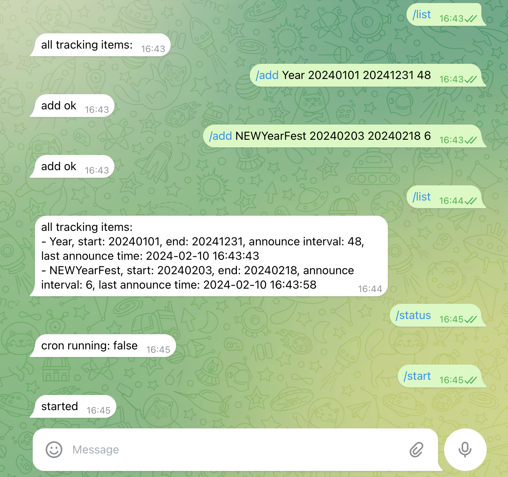
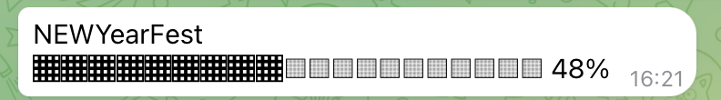

# TimeProgress Bot

- `/add`: Add a new time tracking item
- `/list`: List all time tracking items
- `/delete`: Remove a time tracking item
- `/start`: Start cron check job. (need to run everytime after restart)
- `/status`: Get current cron check job status

Bot will send you a `progress` msg to you.

