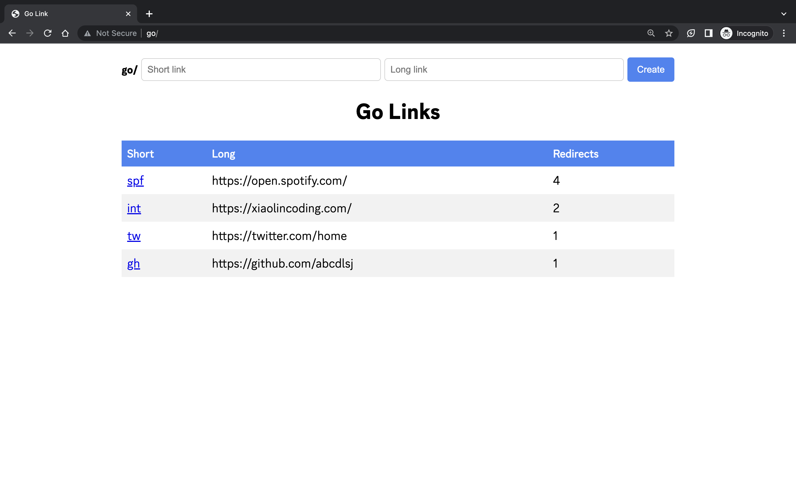

# Go Links

GoLink is a simple URL shortener written in Go. But using `go` as url for accessing.

## SCREENSHOT



## Usage

### Install

```go
go build -o golink
```

```bash
# you can use `-db=<PATH>` to specify the database file, default is `~/.g.db`
./golink -p g.db
```

```bash
# you need add `127.0.0.1 go` to `/etc/hosts`, or you can run with `sudo` and `-i` to do it automatically
sudo ./golink -p g.db -i
```

### Export & Import

use `curl` to export and import data.

```bash
curl -X POST "http://go/.export" > export.json
```

```bash
curl -H "Content-Type: application/json" -d @export.json "http://go/.import"
```

## Reference

Idea is from [tailscale golink](https://github.com/tailscale/golink/tree/main)
